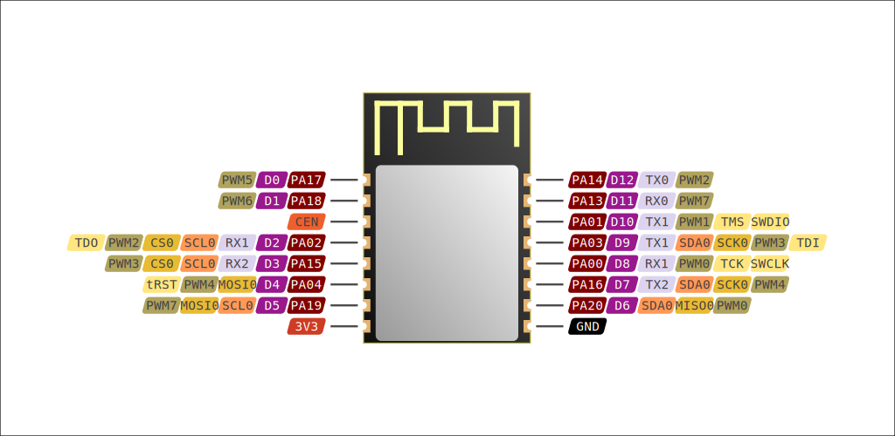

# BW15

*by Ai-Thinker Co., Ltd.*

[Product page](https://docs.ai-thinker.com/_media/rtl8710/docs/bw15_datasheet_en.pdf)

- [General info](../../docs/platform/realtek-amb/README.md)
- [Vendor datasheet](https://docs.ai-thinker.com/_media/rtl8710/docs/bw15_datasheet_en.pdf)

Parameter    | Value
-------------|------------------------------------------
Board code   | `bw15`
MCU          | RTL8720CF
Manufacturer | Realtek
Series       | AmebaZ2
Frequency    | 100 MHz
Flash size   | 2 MiB
RAM size     | 256 KiB
Voltage      | 3.0V - 3.6V
I/O          | 13x GPIO, 8x PWM, 3x UART
Wi-Fi        | 802.11 b/g/n
BLE          | v4.2
FCC ID       | [2AXVG-BW15](https://fccid.io/2AXVG-BW15)

## Usage

**Board code:** `bw15`

In `platformio.ini`:

```ini
[env:bw15]
platform = libretuya
board = bw15
framework = arduino
```

In ESPHome YAML:

```yaml
libretuya:
  board: bw15
  framework:
    version: dev
```

## Pinout



## Arduino Core pin mapping

No. | Pin  | UART      | I²C      | SPI       | PWM  | Other
----|------|-----------|----------|-----------|------|-----------
D0  | PA17 |           |          |           | PWM5 |
D1  | PA18 |           |          |           | PWM6 |
D2  | PA02 | UART1_RX  | I2C0_SCL | SPI0_CS   | PWM2 | TDO
D3  | PA15 | UART2_RX  | I2C0_SCL | SPI0_CS   | PWM3 |
D4  | PA04 | UART1_CTS |          | SPI0_MOSI | PWM4 | tRST
D5  | PA19 | UART2_CTS | I2C0_SCL | SPI0_MOSI | PWM7 |
D6  | PA20 | UART2_RTS | I2C0_SDA | SPI0_MISO | PWM0 |
D7  | PA16 | UART2_TX  | I2C0_SDA | SPI0_SCK  | PWM4 |
D8  | PA00 | UART1_RX  |          |           | PWM0 | SWCLK, TCK
D9  | PA03 | UART1_TX  | I2C0_SDA | SPI0_SCK  | PWM3 | TDI
D10 | PA01 | UART1_TX  |          |           | PWM1 | SWDIO, TMS
D11 | PA13 | UART0_RX  |          |           | PWM7 |
D12 | PA14 | UART0_TX  |          |           | PWM2 |

## Flash memory map

Flash size: 2 MiB / 2,097,152 B / 0x200000

Hex values are in bytes.

Name            | Start    | Length            | End
----------------|----------|-------------------|---------
Partition Table | 0x000000 | 4 KiB / 0x1000    | 0x001000
System Data     | 0x001000 | 4 KiB / 0x1000    | 0x002000
Calibration     | 0x002000 | 4 KiB / 0x1000    | 0x003000
(reserved)      | 0x003000 | 4 KiB / 0x1000    | 0x004000
Boot Image      | 0x004000 | 32 KiB / 0x8000   | 0x00C000
OTA1 Image      | 0x00C000 | 992 KiB / 0xF8000 | 0x104000
OTA2 Image      | 0x104000 | 992 KiB / 0xF8000 | 0x1FC000
Key-Value Store | 0x1FC000 | 8 KiB / 0x2000    | 0x1FE000
User Data       | 0x1FE000 | 8 KiB / 0x2000    | 0x200000
